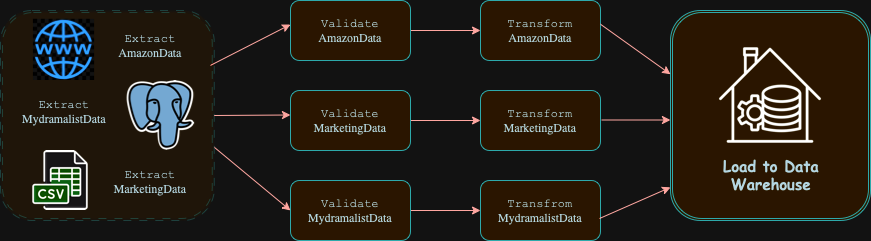

# ETL Pipeline Pacmann - Intro to Data Engineer

## Data Source

Data yang digunakan berasal dari tiga sumber:

1. **Sales data dari database PostgreSQL**: [Database ini dijalankan menggunakan Docker dengan data penjualan Amazon.](https://hub.docker.com/r/shandytp/amazon-sales-data-docker-db)
2. **Marketing data dalam bentuk file CSV**: [Data ini berisi informasi terkait aktivitas marketing dan tersedia sebagai file CSV.](https://drive.google.com/file/d/1J0Mv0TVPWv2L-So0g59GUiQJBhExPYl6/view?usp=sharing)
3. **Web scraping dari website MyDramalist**: [Data review drama Goblin yang diambil langsung dari website MyDramalist melalui teknik scraping.](https://mydramalist.com/18452-goblin)

**Disclaimer**

Proyek ini dibuat untuk tujuan pembelajaran tentang data engineering dan web scraping. Data yang diperoleh dari website hanya digunakan untuk analisis pribadi dan tidak untuk tujuan komersial.

## Problem 
Tim Data Analis membutuhkan data dari berbagai sumber untuk analisis penjualan dan marketing. Proyek ini bertujuan untuk mengumpulkan, memvalidasi, mentransformasi, dan memuat data tersebut ke dalam satu database PostgreSQL yang siap untuk analisis lebih lanjut. dan tim Data Scienties membutuhkan data dari web untuk membuat NLP

## Solution
Untuk menyelesaikan masalah ini, kita akan membuat pipeline ETL yang akan mengumpulkan data dari berbagai sumber seperti database PostgreSQL, file CSV, dan web scraping, lalu memvalidasi dan membersihkan data sebelum akhirnya memuatnya ke dalam database PostgreSQL untuk keperluan analisis penjualan, marketing, dan proyek Natural Language Processing (NLP).

## Luigi ETL Output



### Penjelasan Pipeline

- **Data Extraction**:
  - **Sales Data**: Diambil dari database PostgreSQL.
  - **Marketing Data**: Data dari file CSV.
  - **Web Scraping**: Data diambil dengan melakukan scraping dari website.

- **Data Validation**:
  - Memeriksa kelengkapan data.
  - Memeriksa tipe data (misalnya, format tanggal, harga numerik, dll.).
  - Memeriksa missing value.

- **Data Transformation**:
  - Penggabungan data dari berbagai sumber (amazon, marketing, dan scraping).
  - Transformasi kolom tertentu (misalnya, mengisi missing value, mengubah tipe data, dll).

- **Load to Data WAarehouse**:
  - Semua data yang telah dibersihkan dan ditransformasi dimuat ke dalam tabel di database PostgreSQL untuk analisis lebih lanjut.

## Stack & Tools

### Stack & Tools:
- **Python 3.x**
- **PostgreSQL (Database)**
- **Docker (Database dan lingkungan pengembangan)**
- **Luigi (Untuk orkestrasi pipeline ETL)**
- **Pandas (Manipulasi data)**
- **BeautifulSoup (Web scraping)**
- **Requests (Untuk request HTTP)**

### Libraries:
- `requests`
- `beautifulsoup4`
- `psycopg2`
- `pandas`
- `luigi`

## Langkah-Langkah Membuat Pipeline ETL

1. **Membuat File `.env`**
   - File `.env` digunakan untuk menyimpan variabel lingkungan yang diperlukan oleh aplikasi, seperti kredensial database, agar informasi sensitif tetap aman dan tidak terekspos di repository publik.
   - Contoh isi file `.env`:
     ```plaintext
     DB_USERNAME="user"
     DB_PASSWORD="your_password"
     DB_HOST="localhost"
     DB_PORT="543"
     DB_NAME="your_database_name"
     ```

2. **Menjalankan Docker Compose**
   - Menjalankan **Docker Compose** untuk menjalankan database PostgreSQL di container Docker.
   - Untuk memulai container, jalankan perintah berikut di terminal:
     ```bash
     docker-compose up -d
     ```
3. **Membuat init.sql**
   - Buat file bernama init.sql yang berisi perintah SQL untuk menginisialisasi database, untuk pembuatan tabel ketika proses load.

3. **Membuat ETL Pipeline**
   - Membuat script python dengan nama file `etl_pipeline.py` yang berisi proses etl pipeline.

4. **Menjalankan Pipeline**
   - Membuat script `run_etl.sh` yang berisi perintah untuk menjalankan pipeline.
   - Setelah membuat script ini, pastikan script memiliki permission yang benar dengan menjalankan perintah:
     ```bash
     chmod 755 run_etl.sh
     ```
   - Kemudian menjalankan:
     ```bash
     ./run_etl.sh
     ```
